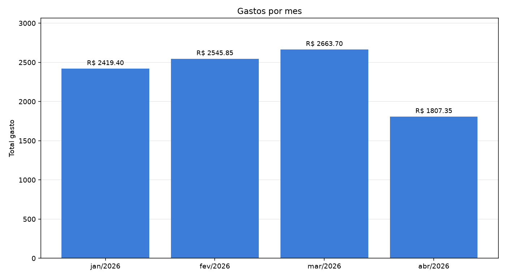

# gastos-graficos

Script que lê os arquivos CSV que você exportou do seu banco, soma os gastos mês a
mês e gera um gráfico de barras.

Um mês por barra, com o total em cima. É só isso — e é suficiente para explicar.



## Como usar

```bash
git clone https://github.com/phdev1991/gastos-graficos.git
cd gastos-graficos
pip install -r requirements.txt
```

Coloque os `.csv` do seu banco numa pasta (por exemplo `meus-csvs/`) e rode:

```bash
python main.py meus-csvs
```

O programa imprime o total de cada mês e salva o gráfico em `gastos.png`.

Sem argumentos, ele lê os `.csv` da pasta onde você está:

```bash
python main.py
```

## Testando sem usar dado de verdade

A pasta `exemplo/` tem dois CSVs fictícios, com formatos diferentes de banco:

```bash
python main.py exemplo
```

## Sobre os CSVs

O programa não precisa saber de antemão o formato do seu banco. Ele procura, no
cabeçalho, uma coluna de **data** e uma de **valor**, entre os nomes mais comuns
(`data`, `date`, `valor`, `amount`, `montante`, ...). Os formatos de data
`2026-01-15`, `15/01/2026` e `15-01-26` são entendidos, e valores como
`1.234,56`, `R$ 1.234,56` e `-99,90` também.

Se nenhuma coluna bater, o programa diz quais colunas encontrou em vez de quebrar.

## Testes

```bash
python -m unittest discover tests -v
```

## Estrutura

| Arquivo | O que faz |
|---|---|
| `main.py` | Junta tudo: lê a pasta, imprime, chama o gráfico |
| `leitor.py` | Descobre as colunas, converte data/valor, soma por mês |
| `graficos.py` | Desenha e salva o gráfico |
| `tests/` | Testes do leitor (onde mora o bug) |